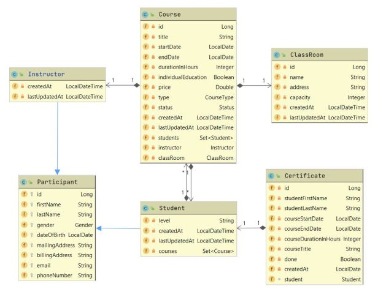

# Hairdressing Training Centre

## Overview

The app provides support for a hairdressing training centre to manage students, courses, instructors and training locations. Furthermore, it is possible to manage courses. The app notifies learners by email of course enrolment and cancellation, course completion and certificate details. The application helps to make enrolment in courses more transparent, to keep track of learners and to better target additional learners.

## The structure of the application

One student can have several courses, one course can have several students. Courses must have a classroom, a course can have one classroom. One course can be taught by one instructor, one instructor can have several courses. A student can obtain several certificates by completing several courses, but a certificate can only be issued to one student.
___

## How the application works

### Basic data management functions

CRUD operations can be performed on all entities in the application. When registering a new participant (student and instructor), the name, mailing address, phone number and email address are mandatory. The email address must be unique. When editing a course, it is mandatory to specify the teaching location, the availability of the classroom will be checked based on the mandatory start and end dates. In addition, the title, length, type and price of the course must be indicated. Instructors can be assigned to courses at a later stage. 

### Course management

Within the course management function, you can coordinate the enrolment of students in courses. When a new student wants to enrol for a course, he/she must first register his/her details in the system and then the enrolment for courses can be started. Registration is only possible for courses that have not yet been completed.

It is possible to attend individual or group courses, both practical and theoretical. The application stores the maximum capacity of a given location and once the maximum number of applicants has been reached, no more students can enrol for the course. 

Course completers receive a certificate. If a student cannot complete the course, they can be removed from the list of students.

Learners will be informed by email about the actions within the course management function.

### Queries

Useful filtering options are available for training purposes. You can query the list of participants. Here, the application does not display all data stored for participants. The data displayed are those which may be of interest to the training organiser or the trainer in the course of the training. The courses of the trainees and trainers can be listed. It is possible to filter the list of courses by their status (completed, in progress, planned). Certificates obtained are available and can be queried by student ID number.

## Applied technologies

| function | implementation |
| ------ | ------ |
| project | Spring Boot, Gradle, Java 8 |
| database management | H2 |
| database schema versioning  | Flyway |
| containerization | Docker |
| testing | Junit5, MockMVC, Mockito |
| validation | Javax|
| documentation | Swagger

